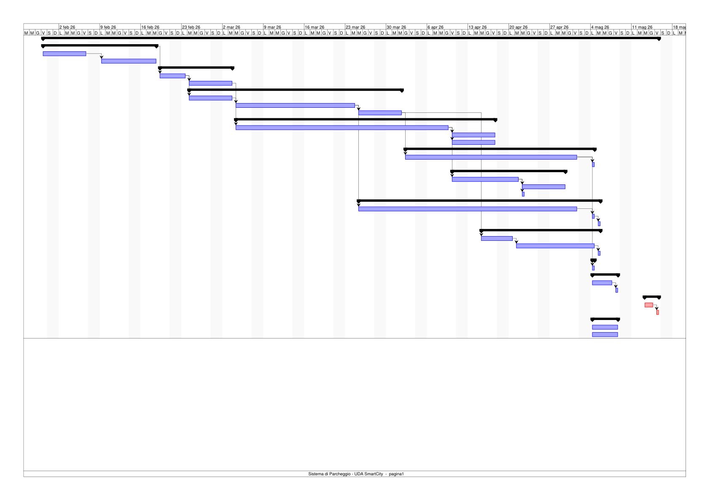
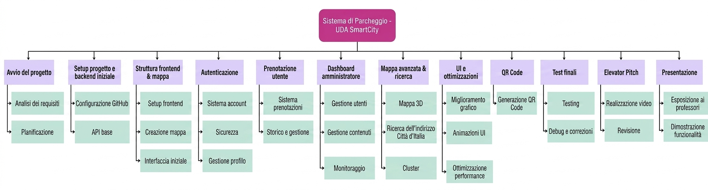

# Parcheggio — Progetto Smart City

https://github.com/user-attachments/assets/a227422d-8461-4248-afb7-4fff789b9c80

Il progetto "Parcheggio" nasce con l'obiettivo di offrire una soluzione completa per la ricerca, la visualizzazione e la prenotazione dei parcheggi in un contesto Smart City. Il sistema mette a disposizione un backend leggero per la gestione di utenti, parcheggi e prenotazioni, e un frontend reattivo che consente agli utenti di esplorare la mappa, filtrare i risultati e prenotare posti. Le API sono progettate per essere sicure (JWT) e facilmente integrabili con client esterni; è prevista inoltre un'area amministrativa protetta per le operazioni di gestione.

## Funzionalità principali
L'applicazione permette di cercare e visualizzare parcheggi su una mappa, applicando filtri per orari, disponibilità e tipologia. Gli utenti possono effettuare prenotazioni, visualizzare e cancellare le proprie prenotazioni, mentre gli amministratori dispongono di un pannello per eseguire operazioni CRUD sui parcheggi e gestire gli utenti. Le API espongono in modo RESTful tutte le operazioni necessarie per il funzionamento del servizio.


https://github.com/user-attachments/assets/89816008-e83c-4705-a982-5091cd098173


Per gli amministratori è stata aggiunta una sezione apposita per aggiungere, modificare o eliminare dei parhceggi. Un'altra sezione è dedicata alla gestione e visualizzazione delle prenotazioni, con i relativi utenti. Inoltre, sono presenti dei grafici, con lo scopo di dare un'idea immediata della situazione della situazione corrente


https://github.com/user-attachments/assets/26271dd8-2dfe-4f05-96cf-2855105b203a


## Architettura e componenti (riassunto)
Il backend è scritto in PHP con un'architettura di tipo controller/repository; gestisce le rotte e la logica applicativa ed espone le API. Tra i file principali troviamo `index.php` come punto di ingresso, `conf/config.php` per le configurazioni (database, chiavi JWT), la cartella `Controller/` che contiene `AdminController.php`, `AuthController.php` e `ParcheggiController.php`, i repository in `Model/` per l'accesso ai dati e i middleware in `Middleware/` (`JWTMiddleware.php`, `JWTAdminMiddleware.php`) che proteggono le rotte. La connessione al database è incapsulata in `Util/Connection.php`.

Il frontend è una single-page application basata su React e Vite: i componenti principali per l'interazione con la mappa e la UI sono in `src/` (per esempio `Mappa.jsx`, `Markers.jsx`, `SearchBox.jsx`) e le pagine principali gestiscono autenticazione, dashboard, elenco parcheggi, prenotazioni e profilo. Il file `api.js` funge da wrapper per le chiamate al backend e per la gestione dei token.

Il database è fornito tramite dump e script nella cartella `database/`. Le dipendenze PHP sono gestite con Composer e si trovano in `vendor/`.

## Requisiti funzionali
Il sistema prevede i seguenti requisiti funzionali:

- Autenticazione e autorizzazione tramite JWT per utenti e amministratori.
- Registrazione e login degli utenti.
- Visualizzazione di una mappa interattiva con marker e dettagli dei parcheggi.
- Ricerca e filtri per orario, disponibilità e caratteristiche dei parcheggi.
- Funzionalità di prenotazione: creazione, cancellazione e consultazione dello storico personale.
- Operazioni CRUD sui parcheggi accessibili agli amministratori.
- Esposizione di API RESTful per l'integrazione con client esterni.
- Protezione delle rotte sensibili tramite middleware JWT.

## Requisiti non funzionali
Dal punto di vista non funzionale, il progetto soddisfa i seguenti requisiti:

- Estendibilità e manutenibilità attraverso la separazione tra logica di business e accesso ai dati (controller/repository).
- Sicurezza operativa: gestione corretta di JWT, protezione delle rotte amministrative e uso di variabili d'ambiente per i segreti.
- Performance: API leggere e reattive; possibilità di caching lato client per dati non sensibili.
- Portabilità: compatibilità con stack LAMP/LEMP e build del frontend con Vite.
- Deploy e operatività: adatto sia a hosting tradizionale sia a containerizzazione (es. Docker) per ambienti cloud.

## Struttura delle cartelle (riassunto)
La radice del progetto contiene le cartelle principali: `backend/` per il codice PHP server-side, configurazioni e middleware; `frontend/` per l'app React (Vite) con componenti e pagine; `database/` per i dump SQL e le istruzioni di import/export; `testers/` per file utili a testare le rotte (ad es. `test-routes.http`); e `vendor/` per le dipendenze PHP gestite da Composer.

## Installazione e avvio (sviluppo)
Prerequisiti: PHP 7.4+ (o versione compatibile), Composer, Node.js 14+ e un server MySQL/Postgres compatibile.

Per il backend:

- installare docker
- Clonare la [repository](https://github.com/ProfAndreaPollini/docker_lamp) per avere l'ambiente docker pronto
- Spostare i file contenuti nella cartella `backend\` nella cartella `www\` di docker_lamp e seguire i comandi presenti nella repository
- Per importare il DataBase seguire le istruzioni persenti in `database\export-import-db.md`

Per il frontend:

```bash
cd frontend
npm install
npm run dev
```

Per eseguire l'API in locale è possibile utilizzare il server built-in di PHP o configurare un virtual host verso `backend/index.php`.

## API e rotte (panoramica)
Le rotte principali esposte dalle API includono gli endpoint per l'autenticazione (`POST /auth/login` che restituisce il JWT e, se previsto, `POST /auth/register` per la registrazione), gli endpoint per la gestione dei parcheggi (`GET /parcheggi` per l'elenco con filtri e `GET /parcheggi/{id}` per i dettagli) e la creazione di prenotazioni (`POST /prenotazioni`, richiede autenticazione). Le rotte amministrative sotto `admin/*` sono protette e permettono operazioni CRUD su parcheggi e gestione utenti. Per la lista completa delle rotte e dei parametri, consultare la cartella `backend/Controller`.

## Sicurezza
L'autenticazione e l'autorizzazione si basano su JWT; i middleware verificano la validità del token e i ruoli dell'utente. Si raccomanda di non inserire segreti nel controllo di versione e di utilizzare variabili d'ambiente o file di configurazione locali non versionati per le chiavi e le credenziali.

## Note operative
Prima di utilizzare l'app in modalità completa è opportuno importare il database con gli script presenti in `database/`. Il file `testers/test-routes.http` contiene esempi di richieste per testare le API in fase di sviluppo.

## Come contribuire
Per contribuire al progetto, aprire issue per bug o proposte di funzionalità, creare una fork per la feature, implementare i cambiamenti con eventuali test e inviare una pull request per la revisione.


## Documentazione UDA SmartCity

Di seguito una breve descrizione delle sezioni presenti e di cosa contengono:

- **Timeline (GANTT):** sintesi cronologica delle attività con date e dipendenze; il grafico GANTT è disponibile in [docs/uda-smartcity/images/](docs/uda-smartcity/images/).
- **WBS:** struttura di scomposizione del lavoro (Work Breakdown Structure); immagine disponibile in [docs/uda-smartcity/images/WBS.png](docs/uda-smartcity/images/WBS.png).
- **Budget:** ripartizione dei costi per fase (importi in €, percentuali sul totale) con la tabella riepilogativa seguente.
- **Stakeholder:** elenco dei ruoli chiave, responsabilità e contatti principali.
- **Rischi:** riepilogo dei rischi principali con probabilità, impatto e valutazione pesata.
- **Allegati:** risorse originali (Excel, PDF, immagini) disponibili in `docs/uda-smartcity/attachments/` o nella cartella OneDrive sorgente.

---

## Tabella generale
| SEZIONE | CAMPO / DESCRIZIONE | DATI / VALORI |
| --- | --- | --- |
| INFORMAZIONI GENERALI | Nome Progetto | Sistema di Parcheggio - UDA SmartCity |
|  | Codice Progetto | UDA-SMC-4 |
|  | Data | 2026-01-30 |
|  | Revisione | 2026-05-08 |
|  | Repository | GitHub |
| DEFINIZIONE | Scopo del progetto | Ridurre l'inquinamento atmosferico |
|  | Obiettivi di progetto | Ridurre gli agenti inquinanti prodotti dai veicoli in cerca di parcheggio |
|  | Requisiti di alto livello | 1) Database utenti/parcheggi/prenotazioni; 2) BackEnd REST API; 3) FrontEnd responsive |
| TEMPISTICHE | Data inizio | 2026-01-30 |
|  | Data fine | 2026-05-08 |
|  | Durata (gg) | 98 |
| TEAM E STAKEHOLDER | Project Manager | Robolini Paolo |
|  | Membri del team | Stellino Marco; Russo Massimo Tammaro; Singh Gurjinder; Fogazzi Matteo; Mogildea Igor |
|  | Committente | Nardi Simone; Scandale Gaetano |
|  | Sponsor | Nardi Simone; Scandale Gaetano; Bugatti Alessandro; Capasso Andrea; Pollini Andrea; Coffani Maria; Simonetti Giuseppe |
| MILESTONES | Milestone 1 | Realizzazione frontend |
|  | Milestone 2 | Realizzazione backend di testing |
|  | Milestone 3 | Implementazione autenticazione JWT |
| BUDGET | Totale indicativo | €3695 |


## Attività GANTT

| ID | Nome | Durata | Data di Avvio | Data di chiusura | Predecessori |
| --- | --- | --- | --- | --- | --- |
| 0 | Sistema di Parcheggio - UDA | S... 76 giorni | 30/01/26, 08:00 | 15/05/26, 17:00 |  |
| 1 | **Avvio del progetto** | 14 giorni | 30/01/26, 08:00 | 18/02/26, 17:00 |  |
| 1.1 | Analisi dei requisiti | 6 giorni | 30/01/26, 08:00 | 06/02/26, 17:00 |  |
| 1.2 | Pianificazione | 8 giorni | 09/02/26, 08:00 | 18/02/26, 17:00 | 3 |
| 2 | **Setup progetto e backend iniziale** | 9 giorni | 19/02/26, 08:00 | 03/03/26, 17:00 |  |
| 2.1 | Configurazione GitHub | 3 giorni | 19/02/26, 08:00 | 23/02/26, 17:00 | 2 |
| 2.2 | API base | 6 giorni | 24/02/26, 08:00 | 03/03/26, 17:00 | 6 |
| 3 | **Struttura frontend & mappa** | 27 giorni | 24/02/26, 08:00 | 01/04/26, 17:00 |  |
| 3.1 | Setup frontend | 6 giorni | 24/02/26, 08:00 | 03/03/26, 17:00 | 6 |
| 3.2 | Creazione mappa | 15 giorni | 04/03/26, 08:00 | 24/03/26, 17:00 | 9 |
| 3.3 | Interfaccia iniziale | 6 giorni | 25/03/26, 08:00 | 01/04/26, 17:00 | 10 |
| 4 | **Autenticazione** | 33 giorni | 04/03/26, 08:00 | 17/04/26, 17:00 |  |
| 4.1 | Sistema account | 27 giorni | 04/03/26, 08:00 | 09/04/26, 17:00 | 7 |
| 4.2 | Sicurezza | 6 giorni | 10/04/26, 08:00 | 17/04/26, 17:00 | 13 |
| 4.3 | Gestione profilo | 6 giorni | 10/04/26, 08:00 | 17/04/26, 17:00 | 13 |
| 5 | **Prenotazioni utente** | 23 giorni | 02/04/26, 08:00 | 04/05/26, 17:00 |  |
| 5.1 | Sistema prenotazioni | 22 giorni | 02/04/26, 08:00 | 01/05/26, 17:00 | 11 |
| 5.2 | Storico e gestione | 1 giorno | 04/05/26, 08:00 | 04/05/26, 17:00 | 17 |
| 6 | **Dashboard amministratore** | 14 giorni | 10/04/26, 08:00 | 29/04/26, 17:00 |  |
| 6.1 | Gestione utenti | 8 giorni | 10/04/26, 08:00 | 21/04/26, 17:00 | 13 |
| 6.2 | Gestione contenuti | 6 giorni | 22/04/26, 08:00 | 29/04/26, 17:00 | 20 |
| 6.3 | Monitoraggio | 1 giorno | 22/04/26, 08:00 | 22/04/26, 17:00 | 20 |
| 7 | **Mappa avanzata & ricerca** | 30 giorni | 25/03/26, 08:00 | 05/05/26, 17:00 |  |
| 7.1 | Mappa 3D | 28 giorni | 25/03/26, 08:00 | 01/05/26, 17:00 | 10 |
| 7.2 | Ricerca dell'indirizzo | 1 giorno | 04/05/26, 08:00 | 04/05/26, 17:00 | 24 |
| 7.3 | Cluster | 1 giorno | 05/05/26, 08:00 | 05/05/26, 17:00 | 25 |
| 8 | **UI e ottimizzazioni** | 15 giorni | 15/04/26, 08:00 | 05/05/26, 17:00 |  |
| 8.1 | Miglioramento grafico | 4 giorni | 15/04/26, 08:00 | 20/04/26, 17:00 | 11 |
| 8.2 | Animazioni UI | 10 giorni | 21/04/26, 08:00 | 04/05/26, 17:00 | 28 |
| 8.3 | Ottimizzazione performance | 1 giorno | 05/05/26, 08:00 | 05/05/26, 17:00 | 29 |
| 9 | **QR Code** | 1 giorno | 04/05/26, 08:00 | 04/05/26, 17:00 |  |
| 9.1 | Generazione QR Code | 1 giorno | 04/05/26, 08:00 | 04/05/26, 17:00 | 17 |
| 10 | **Test finali** | 5 giorni | 04/05/26, 08:00 | 08/05/26, 17:00 |  |
| 10.1 | Testing | 4 giorni | 04/05/26, 08:00 | 07/05/26, 17:00 |  |
| 10.2 | Debug e correzioni | 1 giorno | 08/05/26, 08:00 | 08/05/26, 17:00 | 34 |
| 11 | **Elevator Pitch** | 3 giorni | 13/05/26, 07:00 | 15/05/26, 17:00 |  |
| 11.1 | Realizzazione video | 2 giorni | 13/05/26, 07:00 | 14/05/26, 17:00 |  |
| 11.2 | Revisione | 1 giorno | 15/05/26, 08:00 | 15/05/26, 17:00 | 37 |
| 12 | **Presentazione** | 5 giorni | 04/05/26, 08:00 | 08/05/26, 17:00 |  |
| 12.1 | Esposizione ai professori | 5 giorni | 04/05/26, 08:00 | 08/05/26, 17:00 |  |
| 12.2 | Dimostrazione funzionalità | 5 giorni | 04/05/26, 08:00 | 08/05/26, 17:00 |  |



## WBS



## Budget

| Nome della fase | Ore stimate | Commit GitHub | Costo della fase | Peso |
| --- | --- | --- | --- | --- |
| Avvio del Progetto | 2 | 1 | €39 | 1.08% |
| Setup progetto e Backend iniziale | 18 | 12 | €348 | 9.68% |
| Frontend e mappa base | 24 | 18 | €464 | 12.90% |
| Autenticazione | 38 | 28 | €734 | 20.43% |
| Prenotazioni utente | 22 | 16 | €425 | 11.83% |
| Dashboard amministrazione | 48 | 34 | €928 | 25.81% |
| Mappa avanzata e ricerca | 14 | 10 | €271 | 7.53% |
| UI e ottimizzazioni | 18 | 14 | €348 | 9.68% |
| QR code | 4 | 3 | €177 | 2.15% |
| Test Finali | 6 | 5 | €116 | 3.23% |
| Elevator Pitch | 7 | 0 | €155 | 3.76% |
| Presentazione | 6 | 0 | €116 | 3.23% |
| Totale | 186 | 135 | €3695 |  |


## Stakehoder

| Nome | Ruolo | Descrizione |
| --- | --- | --- |
| Robolini Paolo | Project Manager, Sviluppatore frontend | Coordinatore delle attività ed exploritory tester |
| Stellino Marco | Sviluppatore full stack | Sviluppatore multifunzione |
| Russo Massimo Tammaro | Sviluppatore backend | Sviluppo del backend in PHP |
| Singh Gurjinder | Sviluppatore frontend | Sviluppo della mappa e del mockup frontend |
| Fogazzi Matteo | Sviluppatore frontend | Fixer di bug minori e tester |
| Mogildea Igor | Addetto al database | Creazione di dati e manutenzione DB SQL |
| Nardi Simone | Docente di GPO | Definizione delle caratteristiche del documento di Business Plan |
|  Scandale Gaetano | Docente di GPO | Definizione delle caratteristiche del documento di Business Plan |
| Bugatti Alessandro | Docente di informatica | Definizione delle caratteristiche del backend |
| Capasso Andrea | Docente di informatica | Definizione delle caratteristiche del backend |
| Pollini Andrea | Docente di TPSIT | Definizione delle funzionalità del frontend |
| Coffani Maria | Docente di TPSIT | Definizione delle funzionalità del frontend |
| Simonetti Giuseppe | Docente di matematica | Analisi statistica dei parcheggi nel ring di Brescia |
| Moretto Efrem | User Story | Imbianchino della provincia di Brescia, gli interessa trovare un parcheggio per il furgoncino che usa per lavorare |
| Famiglia Robolini | User Story | Definizione dell'interfaccia utente ideale |
| Famiglia Stellino | User Story | Definizione delle funzioni principali desiderate |


## Rischi

| Rischio | Descrizione | Probabilità | Impatto | Peso | Valutazione | Valutazione pesata |
| --- | --- | --- | --- | --- | --- | --- |
| Tecnico | Tecnologia non stabile, bug complessi | Molto Alta | Molto Alto | 5 | 16.0 | 80 |
| Requisiti | Requisiti incompleti o che cambiano spesso | Bassa | Medio | 2 | 2.0 | 4 |
| Pianificazione / Tempi | Ritardi nello sviluppo o nelle consegne | Molto Alta | Alto | 4 | 12.0 | 48 |
| Budget | Superamento del budget previsto | Bassa | Medio | 2 | 2.0 | 4 |
| Risorse umane | Mancanza di personale o competenze | Media | Medio | 3 | 4.0 | 12 |
| Sicurezza | Vulnerabilità, attacchi, perdita dati | Alta | Molto Alto | 5 | 12.0 | 60 |
| Prestazioni | Software lento o non scalabile | Molto Alta | Medio | 3 | 8.0 | 24 |
| Integrazione | Problemi con API | Molto Alta | Molto alto | 5 | 16.0 | 80 |
| Qualità | Test insufficienti, molti errori | Alta | Medio | 3 | 6.0 | 18 |
| Infrastruttura | Server, cloud o rete non affidabili | Bassa | Basso | 1 | 1.0 | 1 |
| Legale / Compliance | Violazioni normative privacy o licenze software | Bassa | Basso | 1 | 1.0 | 1 |
| Comunicazione | Problemi tra team o con il cliente | Media | Alto | 4 | 6.0 | 24 |
| Rischio di usabilità | Interfaccia difficile da usare | Bassa | Medio | 2 | 2.0 | 4 |
| Manutenzione | Codice difficile da mantenere | Media | Medio | 3 | 4.0 | 12 |
| TOTALE RISCHIO |  |  |  |  |  | 372 |

Il rischio risulta essere molto basso

### Legenda

| SCALA |
| --- |
| Bassa/o = 1 |
| Media/o = 2 |
| Alta/o = 3 |
| Molto Alta/o = 4 |


VALUTAZIONE = Probabilità x Impatto

VALUTAZIONE PESATA = Peso x Valutazione

| FASCIA | PUNTEGGIO |
| --- | --- |
| Nullo | 14-198 |
| Molto basso | 199-382 |
| Basso | 383-566 |
| Medio | 567-750 |
| Alto  | 751-934 |
| Molto alto | 935-1120 |

---

<a href="https://github.com/SteMarco07/Parcheggio">Parcheggio</a> © 2026 is licensed under <a href="https://creativecommons.org/licenses/by-nc-sa/4.0/">CC BY-NC-SA 4.0</a><br/>

